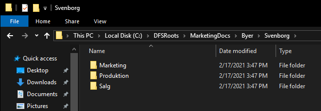
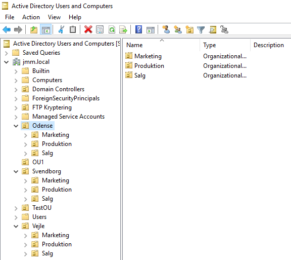
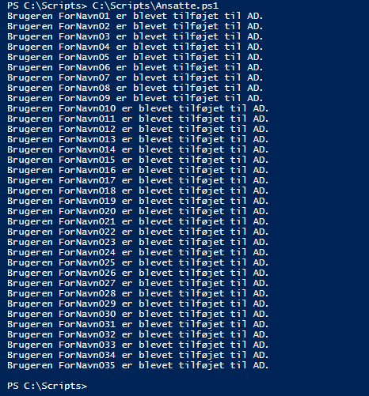
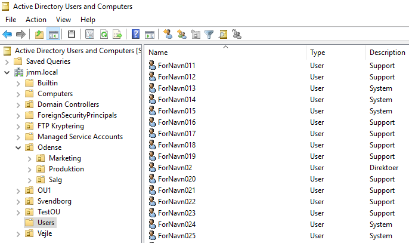
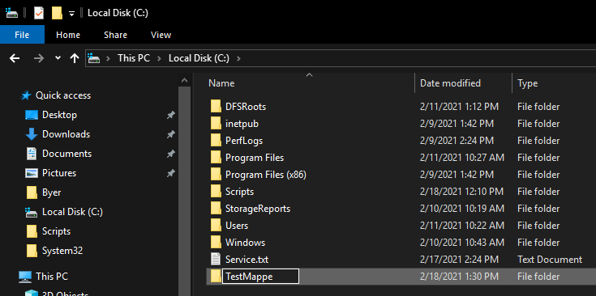
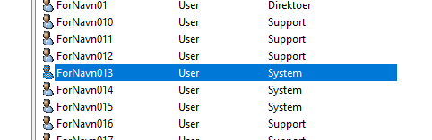
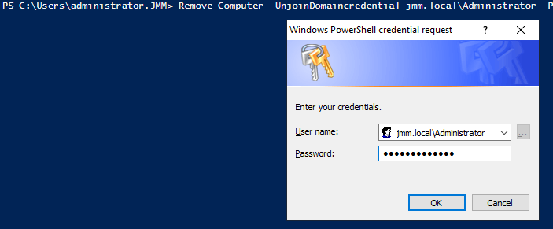
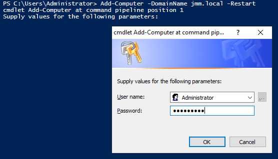
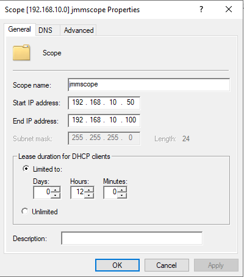

# :computer: Serverautomatisering-HF2

:pencil: Af Jacob, Mark & Mads (JMM.LOCAL)

## Indhold:
* [Del-12 // Disable Powershell GPO](#del-12--disable-powershell-gpo)
* [Del-13 // Hjælpefunktioner](#del-13--hjælpefunktioner)
* [Del-14 // Alias](#del-14--Alias)
* [Del-15 // Ændrer server navn og tilføjer nye ip-adresser](#del-15--ændrer-server-navn-og-tilføjer-nye-ip-adresser)
* [Del-16 // Øget sikkerhed](#del-16--øget-sikkerhed)
* [Del-17 // Mappe script](#del-17--mappe-script)
* [Del-18 // Opret OU'er](#del-18--opret-ouer)
* [Del-19 // Opret AD-brugere](#del-19--Opret-AD-brugere)
* [Del-20 // Whatif](#del-20--Whatif)
* [Del-21 // Windows Recycle Bin](#del-21--Windows-Recycle-Bin)
* [Del-22 // Fjern og tilføj server fra domæne](#del-22--Fjern-og-tilføj-server-fra-domæne)
* [Del-23 // DHCP](#del-23--dhcp)
* [Del-24 // ?](#del-24)


<!-------------------------------------------------------------------- DEL-12 -------------------------------------------------------------------------------------->
## [Del-12 // Disable Powershell GPO](#computer-Serverautomatisering-HF2)


Opretter en ny GPO og går til følgende:
```powershell
User Configuration > Policies > Administrative Templates > System > Don’t run specified Windows applications
```
Click på "Show..." og skriv powershell.exe
<br/>

<br/>
Vores "Disable Powershell" GPO gælder alle Authenticated Users


<!-------------------------------------------------------------------- DEL-13 -------------------------------------------------------------------------------------->
## [Del-13 // Hjælpefunktioner](#computer-Serverautomatisering-HF2)


En cmdlet - udtalt "command-let" er en lille, let kommando, der bruges i Windows PowerShell-miljøet. En cmdlet findes typisk som et lille script, der er beregnet til at udføre en enkelt specifik funktion, såsom coping filer og skift af mapper. En cmdlet og dens relevante parametre kan indtastes i en PowerShell-kommandolinje til øjeblikkelig udførelse eller inkluderes som en del af et længere PowerShell-script, der kan udføres som ønsket.
<br/>
<br/>
Opretter ny computer med New-ADComputer
```powershell
PS C:\>  New-ADComputer
cmdlet New-ADComputer at command pipeline position 1
Supply values for the following parameters:
Name: PC1
```
Den nyoprettede computer
<br/>

<br/>
Opretter ny bruger med New-ADUser
```powershell
PS C:\> New-ADUser
cmdlet New-ADUser at command pipeline position 1
Supply values for the following parameters:
Name: Bruger1
```
Den nyoprettede bruger
<br/>

<br/>
Opretter ny OU med New-ADOrganizationalUnit
```powershell
PS C:\> New-ADOrganizationalUnit
cmdlet New-ADOrganizationalUnit at command pipeline position 1
Supply values for the following parameters:
Name: OU1
```
Den nyoprettede OU
<br/>


<!-------------------------------------------------------------------- DEL-14 -------------------------------------------------------------------------------------->
## [Del-14 // Alias](#computer-Serverautomatisering-HF2)


Et PowerShell-alias er et andet navn, der er tildelt en cmdlet. PowerShell-cmdletnavne kan være besværlig at skrive og bruge. For at minimere indtastning og for at gøre det lettere for brugere der er vant til andre shells som f.eks. CMD eller Unix-shells, understøtter Windows PowerShell begrebet et alias. Simpelthen alias er et alternativt navn til en cmdlet.
<br/>
<br/>
Skriv følgende for en liste af indbyggede Alias
```powershell
PS C:\> Get-Alias
```
Exporterer ovestående liste til [Alias.txt](Alias.txt)
```powershell
PS C:\> Get-Alias | Out-File -FilePath .\Desktop\Alias.txt
```
Opretter egne Alias
```powershell
PS C:\Users\Administrator> Set-Alias
cmdlet Set-Alias at command pipeline position 1
Supply values for the following parameters:
Name: loc
Value: Get-Location
```
Kan nu se min nuværende lokation ved bare at skrive "loc" istedet for Get-Location
```powershell
PS C:\Users\Administrator> loc

Path                  
----                  
C:\Users\Administrator
```
Alias der åbner notepad.exe, notepad kan efterfølgende åbnes ved bare at skrive "np"
```powershell
PS C:\> Set-Alias -Name np -Value C:\Windows\notepad.exe

PS C:\> Get-Alias -Name np

CommandType     Name                                               Version    Source
-----------     ----                                               -------    ------
Alias           np -> notepad.exe
```


<!-------------------------------------------------------------------- DEL-15 -------------------------------------------------------------------------------------->
## [Del-15 // Ændrer server navn og tilføjer nye ip-adresser](#computer-Serverautomatisering-HF2)


Tilføjer IP-addresse lokalt på hhv. server2 og server3
```powershell
PS C:\> Get-NetAdapter

Name                      InterfaceDescription                    ifIndex Status       MacAddress             LinkSpeed
----                      --------------------                    ------- ------       ----------             ---------
Ethernet0                 Intel(R) 82574L Gigabit Network Conn...      15 Up           00-0C-29-8F-4B-92         1 Gbps
PS C:\> New-NetIPAddress -InterfaceIndex 15 -IPAddress 192.168.10.22 -PrefixLength 24

PS C:\> Get-NetAdapter

Name                      InterfaceDescription                    ifIndex Status       MacAddress             LinkSpeed
----                      --------------------                    ------- ------       ----------             ---------
Ethernet0                 Intel(R) 82574L Gigabit Network Conn...      14 Up           00-0C-29-69-48-FC         1 Gbps
PS C:\> New-NetIPAddress -InterfaceIndex 14 -IPAddress 192.168.10.33 -PrefixLength 24
```
Kan nu efterfølgende pinge fra Server1 til de nye ip-adresser
<br/>

<br/>
Omdøber Server2 til Server002 (Gentager dette for Server3 også)
```powershell
PS C:\> hostname
Server2

PS C:\> Rename-Computer -NewName "Server002"
WARNING: The changes will take effect after you restart the computer Server2.
```
Efter en genstart er det nye navn trådt i kraft
<br/>


<!-------------------------------------------------------------------- DEL-16 -------------------------------------------------------------------------------------->
## [Del-16 // Øget sikkerhed](#computer-Serverautomatisering-HF2)


Opretter en liste over kørende services, sorteret alfabetisk og gemmer den som [service.txt](Service.txt). Filen ligger i C:/ da listen laves i .\ som repræsenterer det sted man står i PowerShell.
```powershell
PS C:\> Get-Service | Sort-Object name | Out-File .\Service.txt
```


<!-------------------------------------------------------------------- DEL-17 -------------------------------------------------------------------------------------->
## [Del-17 // Mappe script](#computer-Serverautomatisering-HF2)


Følgende [script](Create-folders.ps1) opretter mapper angivet i [Foldernames.txt](Foldernames.txt)
```powershell
$root = "C:\DFSRoots\MarketingDocs\Byer"

Foreach($folder in Get-Content "$root\Foldernames.txt")
{
    New-Item "$root\$folder" -ItemType Directory -ErrorAction SilentlyContinue
}
```




<!-------------------------------------------------------------------- DEL-18 -------------------------------------------------------------------------------------->
## [Del-18 // Opret OU'er](#computer-Serverautomatisering-HF2)


Der oprettes OU'er for hver afdeling, under hver by, manuelt. De er oprettet med "-ProtectedFromAccidentalDeletion $false" da dette er et testsetup, hvor man har mulighed for at slette OU'er.
```powershell
New-ADOrganizationalUnit -Name Odense -Path "DC=jmm,DC=local" -ProtectedFromAccidentalDeletion $false
New-ADOrganizationalUnit -Name Marketing -Path "OU=Odense,DC=jmm,DC=local" -ProtectedFromAccidentalDeletion $false
New-ADOrganizationalUnit -Name Salg -Path "OU=Odense,DC=jmm,DC=local" -ProtectedFromAccidentalDeletion $false
New-ADOrganizationalUnit -Name Produktion -Path "OU=Odense,DC=jmm,DC=local" -ProtectedFromAccidentalDeletion $false

New-ADOrganizationalUnit -Name Svendborg -Path "DC=jmm,DC=local" -ProtectedFromAccidentalDeletion $false
New-ADOrganizationalUnit -Name Marketing -Path "OU=Svendborg,DC=jmm,DC=local" -ProtectedFromAccidentalDeletion $false
New-ADOrganizationalUnit -Name Salg -Path "OU=Svendborg,DC=jmm,DC=local" -ProtectedFromAccidentalDeletion $false
New-ADOrganizationalUnit -Name Produktion -Path "OU=Svendborg,DC=jmm,DC=local" -ProtectedFromAccidentalDeletion $false

New-ADOrganizationalUnit -Name Vejle -Path "DC=jmm,DC=local" -ProtectedFromAccidentalDeletion $false
New-ADOrganizationalUnit -Name Marketing -Path "OU=Vejle,DC=jmm,DC=local" -ProtectedFromAccidentalDeletion $false
New-ADOrganizationalUnit -Name Salg -Path "OU=Vejle,DC=jmm,DC=local" -ProtectedFromAccidentalDeletion $false
New-ADOrganizationalUnit -Name Produktion -Path "OU=Vejle,DC=jmm,DC=local" -ProtectedFromAccidentalDeletion $false
```
Her kan man se de oprettede OU'er
<br/>



<!-------------------------------------------------------------------- DEL-19 -------------------------------------------------------------------------------------->
## [Del-19 // Opret AD-brugere](#computer-Serverautomatisering-HF2)


For at anvende CSV i vores Powershell script, opretter vi et .csv dokument som hedder [Ansatte.csv](Ansatte.csv) der ligger i C:\Scripts.
Her skriver vi hvad vi vil have med af varibler I øverste linje og under det kommer så alt data på de 35 brugere som passer til de ovenstående variabler.
<br/>
<br/>
I scriptet angiver vi hvor den skal tage data fra, til de Users som skal oprettes. Det er vigtigt med ```–Delimiter ","```, da den angiver afgrænseren der adskiller vores data i CSV-filen. 
Vi tilføjer samtidig nogle linjer, som før at password bliver krypteret og at brugeren bliver enablet, samt at de skal lave et nyt password når de logger på.
Brugeren får udfyldt, navn, efternavn, office, mail, description og password.
Som sidste linje har vi en echo som sørger for vi får udskrevet en tekst ud fra hver bruger som bliver oprettet.
<br/>
<br/>
```powershell
 $Users = Import-Csv -Delimiter "," -Path "C:\Scripts\Ansatte.csv"        
foreach ($User in $Users)
{               
    $UserFirstname = $User.FirstName       
    $UserLastname = $User.LastName
    $UserMail = $user.Mail
    $UserPassword = $User.Password
    $UserDescription = $User.Description
    $UserOffice = $user.Office
    New-ADUser -Name "$UserFirstname" -Office "$UserOffice" -DisplayName "$UserFirstname" -EmailAddress "$UserMail" -GivenName "$UserFirstname" -Surname "$UserLastname" -Description "$UserDescription" -AccountPassword (ConvertTo-SecureString $UserPassword -AsPlainText -Force) -Enabled $true -ChangePasswordAtLogon $true -server jmm.local
    
    echo ("Brugeren "+ $UserFirstname +" er blevet tilføjet til AD.")      
}
```
Følgende output bliver printet når scriptet køres. Dette feedback gør at brugeren kan se at der sker noget:
<br/>

<br/>
Efter scriptet er kørt kan de ny-oprettede brugere ses i AD users and computers:
<br/>



<!-------------------------------------------------------------------- DEL-20 -------------------------------------------------------------------------------------->
## [Del-20 // Whatif](#computer-Serverautomatisering-HF2)


Med ```Whatif``` kan man se resultatet af en kommando inden man vælger at køre den, kommandoen er bliver ikke kørt. På den måde kan vi sikre os at kommadoen gør det vi ønsker og man kan også se hvad kommandoer der ikke genererer noget output gør, når de køres.
<br/>
<br/>
Fjerner AD-User
<br/>
```powershell
PS C:\> Remove-ADUser -Identity ForNavn026 -WhatIf
What if: Performing the operation "Remove" on target "CN=ForNavn026,CN=Users,DC=jmm,DC=local".
```
Opretter folderen "TestMappe"

<br/>
Fjerner mappe
```powershell
PS C:\> Remove-Item 'C:\TestMappe' -WhatIf
What if: Performing the operation "Remove Directory" on target "C:\TestMappe".
```

<!-------------------------------------------------------------------- DEL-21 -------------------------------------------------------------------------------------->
## [Del-21 // Windows Recycle Bin](#computer-Serverautomatisering-HF2)


Aktiverer ```Recycle Bin Feature``` på Server1
```powershell
Enable-ADOptionalFeature 'Recycle Bin Feature' -Scope ForestOrConfigurationSet -Target jmm.local
```
Se slettede objecter (Har slettet brugeren ForNavn013 via GUI'en)
```powershell
PS C:\> Get-ADObject -Filter 'isDeleted -eq $true -and Name -like "*DEL:*"' –IncludeDeletedObjects

Deleted           : True
DistinguishedName : CN=ForNavn013\0ADEL:f9a587fb-5d39-4676-ba8c-b6651e74e15f,CN=Deleted Objects,DC=jmm,DC=local
Name              : ForNavn013
                    DEL:f9a587fb-5d39-4676-ba8c-b6651e74e15f
ObjectClass       : user
ObjectGUID        : f9a587fb-5d39-4676-ba8c-b6651e74e15f
```
Får den slettede bruger tilbage med følgende kommando
```powershell
PS C:\> Get-ADObject -filter {displayname -eq "Fornavn013"} –includedeletedobjects | Restore-ADObject
```
Her man man se den slettede bruger er tilbage igen
<br/>



<!-------------------------------------------------------------------- DEL-22 -------------------------------------------------------------------------------------->
## [Del-22 // Fjern og tilføj server fra domæne](#computer-Serverautomatisering-HF2)


Fjerner Server002 fra domænet
```powershell
Remove-Computer -UnjoinDomaincredential jmm.local\Administrator -PassThru -Verbose -Restart
```

<br/>
<br/>
Tilføjer Server002 til domænet igen med følgende cmdlet
```powershell
Add-Computer -DomainName jmm.local -Restart
```



<!-------------------------------------------------------------------- DEL-23 -------------------------------------------------------------------------------------->
## [Del-23 // DHCP](#computer-Serverautomatisering-HF2)


Noget text her
```powershell
PS C:\> Get-WindowsFeature -Name dhc*

Display Name                                            Name                       Install State
------------                                            ----                       -------------
[ ] DHCP Server                                         DHCP                           Available
```
Noget text her
```powershell
PS C:\> Install-WindowsFeature -Name DHCP -IncludeManagementTools

Success Restart Needed Exit Code      Feature Result
------- -------------- ---------      --------------
True    No             Success        {DHCP Server, DHCP Server Tools}
```
Noget text her
```powershell
PS C:\> Add-DhcpServerv4Scope -ComputerName Server1 -Name “jmmscope” -StartRange 192.168.10.50 -EndRange 192.168.10.100 -SubnetMask 255.255.255.0 -LeaseDuration 0:12:0:0
```
Noget text her
```powershell
PS C:\> Set-DhcpServerv4Optionvalue -computername Server1 -Router 192.168.10.1 -dnsserver 192.168.10.1 -DnsDomain jmm.local
```
Noget text her
```powershell
Add-DhcpServerInDC  Server1 192.168.10.1
```
Noget text her



<br/>
<br/>
<br/>
<br/>

[TOP :arrow_up:](#computer-serverautomatisering-hf2)