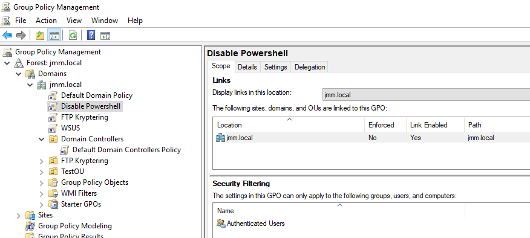
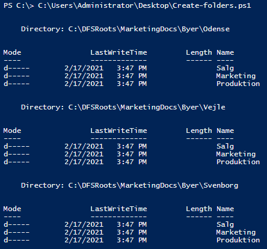

# :computer: Serverautomatisering-HF2

:pencil: Af Jacob, Mark & Mads (JMM.LOCAL)

## Indhold:
* [Del-12 // Disable Powershell GPO](#del-12--disable-powershell-gpo)
* [Del-13 // Hjælpefunktioner](#del-13--hjælpefunktioner)
* [Del-14 // Alias](#del-14--Alias)
* [Del-15 // Ændrer server navn og tilføjer nye ip-adresser](#del-15--ændrer-server-navn-og-ip-adresse)
* [Del-16 // Øget sikkerhed](#del-16--øget-sikkerhed)
* [Del-17 // Mappe script](#del-17--mappe-script)
* [Del-18 // Opret OU'er](#del-18--opret-ouer)
* [Del-19 // Automatisering](#del-19)
* [Del-20 // Whatif](#del-20)
* [Del-21 // Windows Recycle Bin](#del-21)
* [Del-22 // Fjern og tilføj server fra domæne](#del-22)
* [Del-23 // ?](#del-23)
* [Del-24 // ?](#del-24)

<!-------------------------------------------------------------------- DEL-12 -------------------------------------------------------------------------------------->
## [Del-12 // Disable Powershell GPO](#computer-Serverautomatisering-HF2)
Opretter en ny GPO og går til følgende:
```powershell
User Configuration > Policies > Administrative Templates > System > Don’t run specified Windows applications
```
Click på "Show..." og skriv powershell.exe
<br/>

<br/>
Vores "Disable Powershell" GPO gælder alle Authenticated Users


<!-------------------------------------------------------------------- DEL-13 -------------------------------------------------------------------------------------->
## [Del-13 // Hjælpefunktioner](#computer-Serverautomatisering-HF2)
En cmdlet - udtalt "command-let" er en lille, let kommando, der bruges i Windows PowerShell-miljøet. En cmdlet findes typisk som et lille script, der er beregnet til at udføre en enkelt specifik funktion, såsom coping filer og skift af mapper. En cmdlet og dens relevante parametre kan indtastes i en PowerShell-kommandolinje til øjeblikkelig udførelse eller inkluderes som en del af et længere PowerShell-script, der kan udføres som ønsket.
<br/>
<br/>
Opretter ny computer med New-ADComputer
```powershell
PS C:\>  New-ADComputer
cmdlet New-ADComputer at command pipeline position 1
Supply values for the following parameters:
Name: PC1
```
Den nyoprettede computer
<br/>

<br/>
Opretter ny bruger med New-ADUser
```powershell
PS C:\> New-ADUser
cmdlet New-ADUser at command pipeline position 1
Supply values for the following parameters:
Name: Bruger1
```
Den nyoprettede bruger
<br/>

<br/>
Opretter ny OU med New-ADOrganizationalUnit
```powershell
PS C:\> New-ADOrganizationalUnit
cmdlet New-ADOrganizationalUnit at command pipeline position 1
Supply values for the following parameters:
Name: OU1
```
Den nyoprettede OU
<br/>


<!-------------------------------------------------------------------- DEL-14 -------------------------------------------------------------------------------------->
## [Del-14 // Alias](#computer-Serverautomatisering-HF2)
Et PowerShell-alias er et andet navn, der er tildelt en cmdlet. PowerShell-cmdletnavne kan være besværlig at skrive og bruge. For at minimere indtastning og for at gøre det lettere for brugere der er vant til andre shells som f.eks. CMD eller Unix-shells, understøtter Windows PowerShell begrebet et alias. Simpelthen alias er et alternativt navn til en cmdlet.
<br/>
<br/>
Skriv følgende for en liste af indbyggede Alias
```powershell
PS C:\> Get-Alias
```
Exporterer ovestående liste til [Alias.txt](Alias.txt)
```powershell
PS C:\> Get-Alias | Out-File -FilePath .\Desktop\Alias.txt
```
Opretter egne Alias
```powershell
PS C:\Users\Administrator> Set-Alias
cmdlet Set-Alias at command pipeline position 1
Supply values for the following parameters:
Name: loc
Value: Get-Location
```
Kan nu se min nuværende lokation ved bare at skrive "loc" istedet for Get-Location
```powershell
PS C:\Users\Administrator> loc

Path                  
----                  
C:\Users\Administrator
```
Alias der åbner notepad.exe, notepad kan efterfølgende åbnes ved bare at skrive "np"
```powershell
PS C:\> Set-Alias -Name np -Value C:\Windows\notepad.exe

PS C:\> Get-Alias -Name np

CommandType     Name                                               Version    Source
-----------     ----                                               -------    ------
Alias           np -> notepad.exe
```

<!-------------------------------------------------------------------- DEL-15 -------------------------------------------------------------------------------------->
## [Del-15 // Ændrer server navn og tilføjer nye ip-adresser](#computer-Serverautomatisering-HF2)
Tilføjer IP-addresse lokalt på hhv. server2 og server3
```powershell
PS C:\> Get-NetAdapter

Name                      InterfaceDescription                    ifIndex Status       MacAddress             LinkSpeed
----                      --------------------                    ------- ------       ----------             ---------
Ethernet0                 Intel(R) 82574L Gigabit Network Conn...      15 Up           00-0C-29-8F-4B-92         1 Gbps
PS C:\> New-NetIPAddress -InterfaceIndex 15 -IPAddress 192.168.10.22 -PrefixLength 24

PS C:\> Get-NetAdapter

Name                      InterfaceDescription                    ifIndex Status       MacAddress             LinkSpeed
----                      --------------------                    ------- ------       ----------             ---------
Ethernet0                 Intel(R) 82574L Gigabit Network Conn...      14 Up           00-0C-29-69-48-FC         1 Gbps
PS C:\> New-NetIPAddress -InterfaceIndex 14 -IPAddress 192.168.10.33 -PrefixLength 24
```
Kan nu efterfølgende pinge fra Server1 til de nye ip-adresser
<br/>

<br/>
Omdøber Server2 til Server002 (Gentager dette for Server3 også)
```powershell
PS C:\> hostname
Server2

PS C:\> Rename-Computer -NewName "Server002"
WARNING: The changes will take effect after you restart the computer Server2.
```
Efter en genstart er det nye navn trådt i kraft
<br/>


<!-------------------------------------------------------------------- DEL-16 -------------------------------------------------------------------------------------->
## [Del-16 // Øget sikkerhed](#computer-Serverautomatisering-HF2)
Opretter en liste over kørende services, sorteret alfabetisk og gemmer den som [service.txt](Service.txt)
```powershell
PS C:\> Get-Service | Sort-Object name | Out-File .\Service.txt
```

<!-------------------------------------------------------------------- DEL-17 -------------------------------------------------------------------------------------->
## [Del-17 // Mappe script](#computer-Serverautomatisering-HF2)
Følgende [script](Create-folders.ps1) opretter mapper angivet i [Foldernames.txt](Foldernames.txt)
```powershell
$root = "C:\DFSRoots\MarketingDocs\Byer"

Foreach($folder in Get-Content "$root\Foldernames.txt")
{
    New-Item "$root\$folder" -ItemType Directory -ErrorAction SilentlyContinue
}
```



<!-------------------------------------------------------------------- DEL-18 -------------------------------------------------------------------------------------->
## [Del-18 // Opret OU'er](#computer-Serverautomatisering-HF2)
```powershell
New-ADOrganizationalUnit -Name Odense -Path "DC=jmm,DC=local" -ProtectedFromAccidentalDeletion $false
New-ADOrganizationalUnit -Name Marketing -Path "OU=Odense,DC=jmm,DC=local" -ProtectedFromAccidentalDeletion $false
New-ADOrganizationalUnit -Name Salg -Path "OU=Odense,DC=jmm,DC=local" -ProtectedFromAccidentalDeletion $false
New-ADOrganizationalUnit -Name Produktion -Path "OU=Odense,DC=jmm,DC=local" -ProtectedFromAccidentalDeletion $false

New-ADOrganizationalUnit -Name Svendborg -Path "DC=jmm,DC=local" -ProtectedFromAccidentalDeletion $false
New-ADOrganizationalUnit -Name Marketing -Path "OU=Svendborg,DC=jmm,DC=local" -ProtectedFromAccidentalDeletion $false
New-ADOrganizationalUnit -Name Salg -Path "OU=Svendborg,DC=jmm,DC=local" -ProtectedFromAccidentalDeletion $false
New-ADOrganizationalUnit -Name Produktion -Path "OU=Svendborg,DC=jmm,DC=local" -ProtectedFromAccidentalDeletion $false

New-ADOrganizationalUnit -Name Vejle -Path "DC=jmm,DC=local" -ProtectedFromAccidentalDeletion $false
New-ADOrganizationalUnit -Name Marketing -Path "OU=Vejle,DC=jmm,DC=local" -ProtectedFromAccidentalDeletion $false
New-ADOrganizationalUnit -Name Salg -Path "OU=Vejle,DC=jmm,DC=local" -ProtectedFromAccidentalDeletion $false
New-ADOrganizationalUnit -Name Produktion -Path "OU=Vejle,DC=jmm,DC=local" -ProtectedFromAccidentalDeletion $false
```
Her kan man se de oprettede OU'er
<br/>

